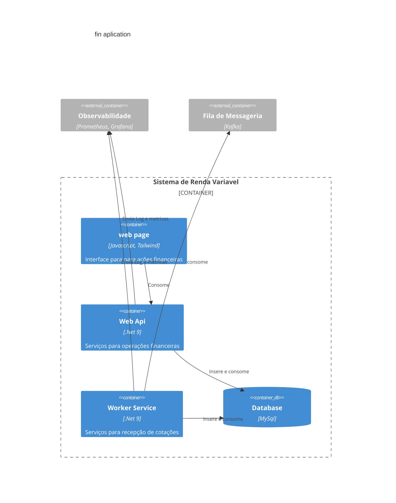

# Serviços de Renda Variável
Arquitetura do serviço de renda variável.

# Como Executar
Instruções para executar aplicação localmente.

## Configurações de variáveis de ambiente
Use o arquivo `.env-example` para criar seu arquivo `.env` com suas variaveis de ambiente.
