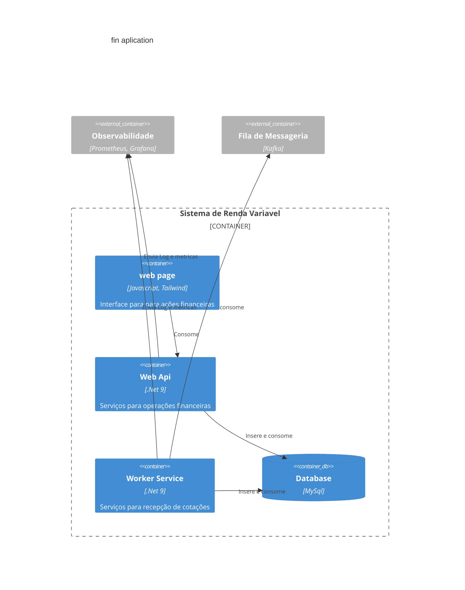

# Serviços de Renda Variável
[](https://github.com/davypaulino/finrv/actions/workflows/build-and-test.yml)
[](https://github.com/davypaulino/finrv/actions/workflows/codeql.yml)

### [Documentação da API](https://localhost:7578/api-reference)

### Arquitetura do serviço de renda variável (Container C4 Model)




Claro! Aqui está uma versão aprimorada da sua documentação, com correções, mais clareza e melhor organização:

---

# 📌 Como Executar  
Guia para configurar e rodar a aplicação localmente.

___

## 🚀 **Pré-requisitos**
Certifique-se de ter os seguintes itens instalados antes de iniciar:  

- [`.NET 9`](https://dotnet.microsoft.com/)  
- [`Entity Framework Core 9`](https://learn.microsoft.com/en-us/ef/core/)  
- [`Podman`](https://podman.io/) ou [`Docker`](https://www.docker.com/)  
- *Imagems para containers:*
	- `mysql:8`  

___

## ⚙️ **Configuração de Variáveis de Ambiente**  
Antes de executar a aplicação, configure suas variáveis de ambiente.  

- 1️⃣ Copie o arquivo `.env-example` e renomeie para `.env`.  
- 2️⃣ Edite o `.env` e ajuste os valores conforme necessário.
- 🔹 O arquivo `.env` deve estar na raiz do projeto para que o `docker-compose.yml` consiga encontrá-lo.

___

## 🛠️ **Executando o Banco de Dados**  
Use os seguintes comandos para iniciar os containers do MySQL:

🔹 *Com Docker:* 
```bash
docker-compose up -d
```
🔹 *Com Podman:* 
```bash
podman-compose up -d
```
> O parâmetro `-d` mantém o container rodando em segundo plano.

___

## 📌 **Aplicando as Migrations**  
Se for necessário aplicar **migrations** no banco de dados, use os comandos abaixo.

🔹 *Via Package Manager Console (PMC)*  
> Executar dentro do projeto `ApiService`  
```powershell
Update-Database -Project finrv.Infra
```

🔹 *Via Linha de Comando (`dotnet ef` CLI)*  
> Executar dentro do projeto `ApiService`  
```bash
dotnet ef database update --project finrv.Infra
```
